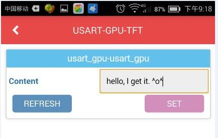
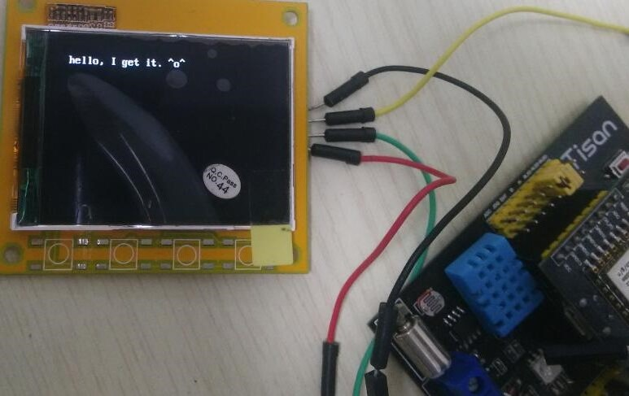
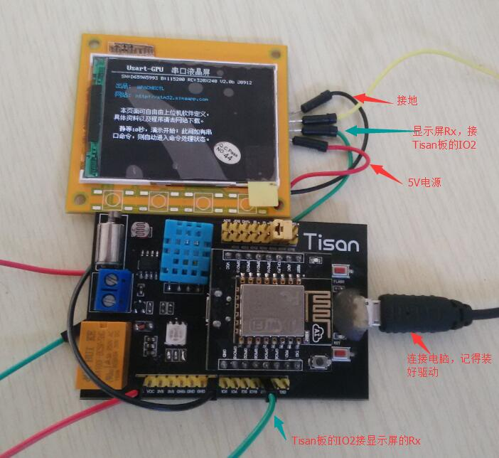
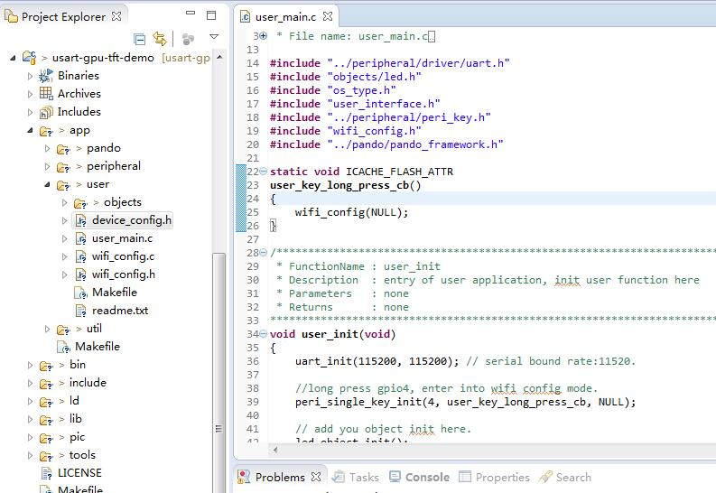
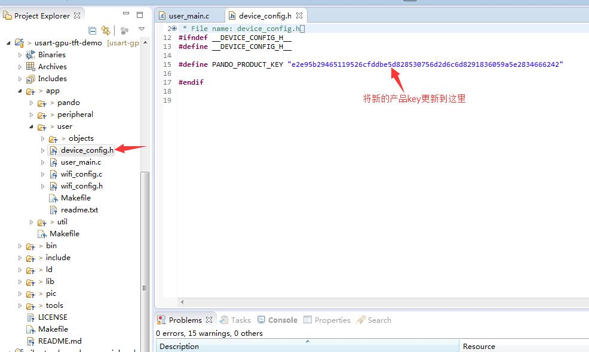
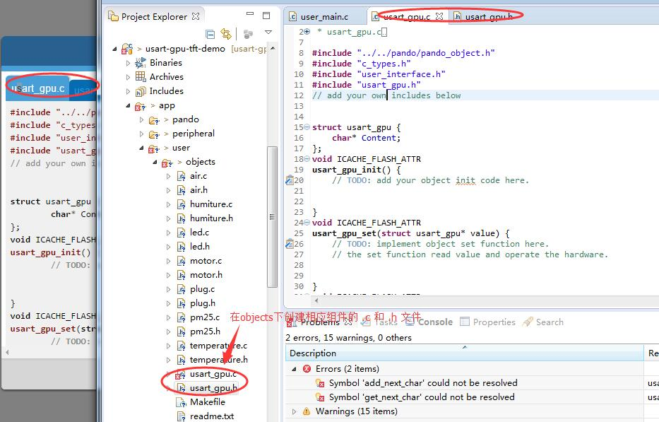
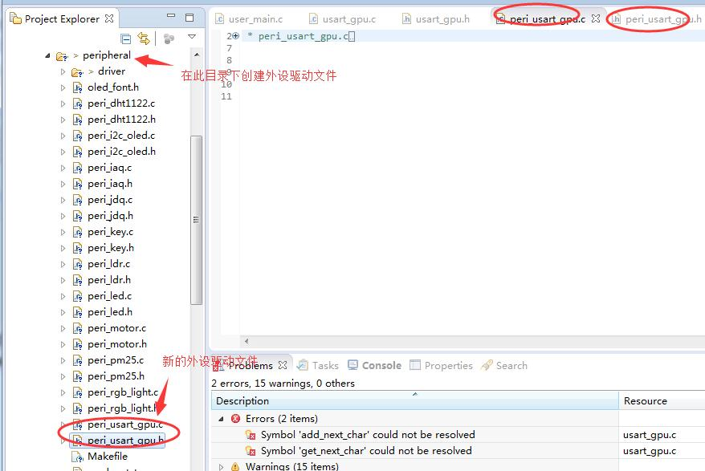
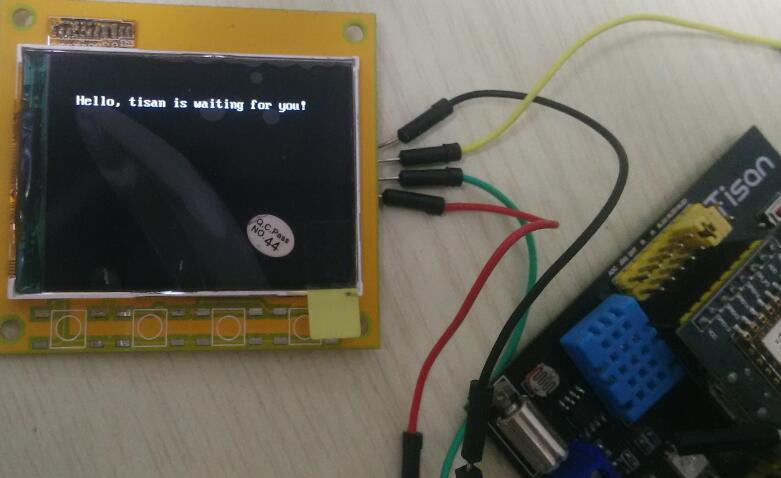

# usart-gpu-tft-demo 基于串口显示液晶屏的Demo
基于串口显示液晶屏的Demo，演示从手机上发送文字信息，文字在屏上显示出来。

要做到手机输入一段文字，发送即可显示到屏上。比如手机输入如图：  
   
显示屏上即显示：  
   


# 准备  
首先，作为一个Tisan开发者，当然要使用Tisan的WebIDE了，这是进行框架开发的必备条件，WebIDE的其他用处暂不多说哈。  
WebIDE的官网：[http://tisan.pandocloud.com/](http://tisan.pandocloud.com/)   
tisan-doc: [tisan-doc](https://sw0813.gitbooks.io/tisan-doc/content/)  
相关的视频教程： [http://i.youku.com/u/UMTIwNTA2MTM2MA==](http://i.youku.com/u/UMTIwNTA2MTM2MA==)  
Tisan论坛链接：[http://bbs.elecfans.com/zhuti_820_1.html](http://bbs.elecfans.com/zhuti_820_1.html)  

## 硬件  
1. Tisan开发板；  
2. 能上网的wifi路由；  
3. 能上wifi的手机（^^)，支持安卓和iOS；  
4. PC。  
5. Usart-GPU串口显示液晶屏。该屏可在淘宝上购得。其公司网址：[http://stm32.sinaapp.com/](http://stm32.sinaapp.com/)  ，具体的使用文档可以在其公司网址上下载。  


## 软件  
1. 在PC上下载固件开发的IDE，可到资源中心下载：[http://pan.baidu.com/s/1c0r0ba4](http://pan.baidu.com/s/1c0r0ba4), 具体的开发环境介绍可参考[tisan开发环境介绍](https://sw0813.gitbooks.io/tisan-doc/content/cn/environment.html)  
2. 安装freeiot，下载链接和使用说明请参考[快速体验](https://sw0813.gitbooks.io/tisan-doc/content/cn/quick-start.html)    
3. 如果想用微信控制，可先关注微信公众号：freeiot。  
4. 准备固件烧录工具，也在资源中心下载。  
5. 到开源项目管理网站github下载tisan-demo的源代码：[https://github.com/tisan-kit/tisan-demo/archive/master.zip](https://github.com/tisan-kit/tisan-demo/archive/master.zip)。  

# 搭建硬件环境  
1. 显示屏的电源口连接Tisan板的5V电源；  
2. 将显示屏的RX口连接Tisan板的IO2，即esp8266的串口1的tx，进行串口通信。
如图：
  

# 在WebIDE上创建产品  


# 固件开发  
在固件开发的IDE上导入下载的 tisan-demo 的源代码，如图：  
  

## 更新产品key
复制WebIDE上创建的（USART-GPU-TFT）产品key到 device_config.h 文件中。  
  

## 处理产品组件代码  
将创建的产品组件（usart_gpu）的代码复制到 app/user/objects 目录下（需要创建相应的文件，两个文件，usart_gpu.c 和 usart_gpu.h），如图：  
  

## 外设驱动开发  
为了支持object的功能，需要进行相应的外设驱动开发。本应用涉及到串口应用（串口1），会调用串口1的发送功能。  外设驱动的方法大概可以参考其他现有外设驱动开发的模式来套，具体是实现object里面的get和set需要调用的方法，负责与将控制指令在外设上实现。
步骤1 添加两个文件 peri_usart_gpu.c 和 peri_usart_gpu.h， 如图：  
  

步骤2 在外设文件上添加代码 
peri_usart_gpu.c 添加代码如下
```
#include "peri_usart_gpu.h"
#include "user_interface.h"
#include "eagle_soc.h"
#include "driver/key.h"
#include "os_type.h"
#include "mem.h"
#include "driver/uart.h"

uint8* ICACHE_FLASH_ATTR
peri_usart_gpu_get()
{
    uint8* dat;

    return dat;
}

void ICACHE_FLASH_ATTR
peri_usart_gpu_set(char* dat)
{
	int length = 0;
	uint16 i= 0;

	if(dat == NULL)
		return;
	length = os_strlen(dat);

	uart1_sendStr_no_wait("CLS(0);");
	uart1_sendStr_no_wait("BS16(20,20,286,4,'");

	for(i=0; i<length; i++)
	{
		uart_tx_one_char_no_wait(UART1, dat[i]);
	}
	uart1_sendStr_no_wait("',15);\r\n");
}

void ICACHE_FLASH_ATTR
peri_usart_gpu_init(void)
{
	uart1_sendStr_no_wait("CLS(0);");
	uart1_sendStr_no_wait("CLS(0);\r\n");   //init
	uart1_sendStr_no_wait("BS16(20,35,280,4,'Hello, tisan is waiting for you!',15);");
	uart1_sendStr_no_wait("\r\n");
} 

```  

peri_usart_gpu.h 文件添加代码如下：  
```
#include "c_types.h"

void peri_usart_gpu_init(void);
uint8* peri_usart_gpu_get();
void peri_usart_gpu_set(char* dat);
```

## 将外设驱动的功能合进组件相应的功能函数里面
 在object中引用相应的外设.h文件，补充组件的初始化函数、get和set函数，这里主要是用了set函数：  
```
void ICACHE_FLASH_ATTR
usart_gpu_init() {
	// TODO: add your object init code here.
	peri_usart_gpu_init();
}
void ICACHE_FLASH_ATTR
usart_gpu_set(struct usart_gpu* value) {
	// TODO: implement object set function here.
	// the set function read value and operate the hardware.
	peri_usart_gpu_set(value->Content);

}
```  

##  处理user.main.c 文件  
在 user_main.c 文件里引用新组件头文件：    
```  
#include "objects/usart_gpu.h"  
```  

并在入口函数 user_init(void) 里面添加初始化组件函数： usart_gpu_boject_init()  ：  

```
void user_init(void)
{
	uart_init(115200, 115200); // serial bound rate:11520.

	//long press gpio4, enter into wifi config mode.
	peri_single_key_init(4, user_key_long_press_cb, NULL);

	// add you object init here.
	//led_object_init();
	usart_gpu_object_init();

	pando_framework_init();
}

```

# 编译并烧录固件  
编译和烧录固件请参考 tisan-doc 的开发环境介绍。  
烧录成功后，复位开发板，板子即正常运行，如图：  
  

# 配置开发板上网并且添加设备 
  添加设备成功后，手机就可以发文到显示屏显示了！如开篇所示。


# 不足和需要改善的方向 
1. 还不能显示中文。由于服务器下发的数据是UTF-8的码格式，而串口显示屏不支持UTF-8格式，能支持GBK或者GB2312的码，嵌入式这边处理编码转换比较耗资源；   
2. 支持丰富背景颜色和文字；   
3. 支持远程发送图片，并显示出来。 

